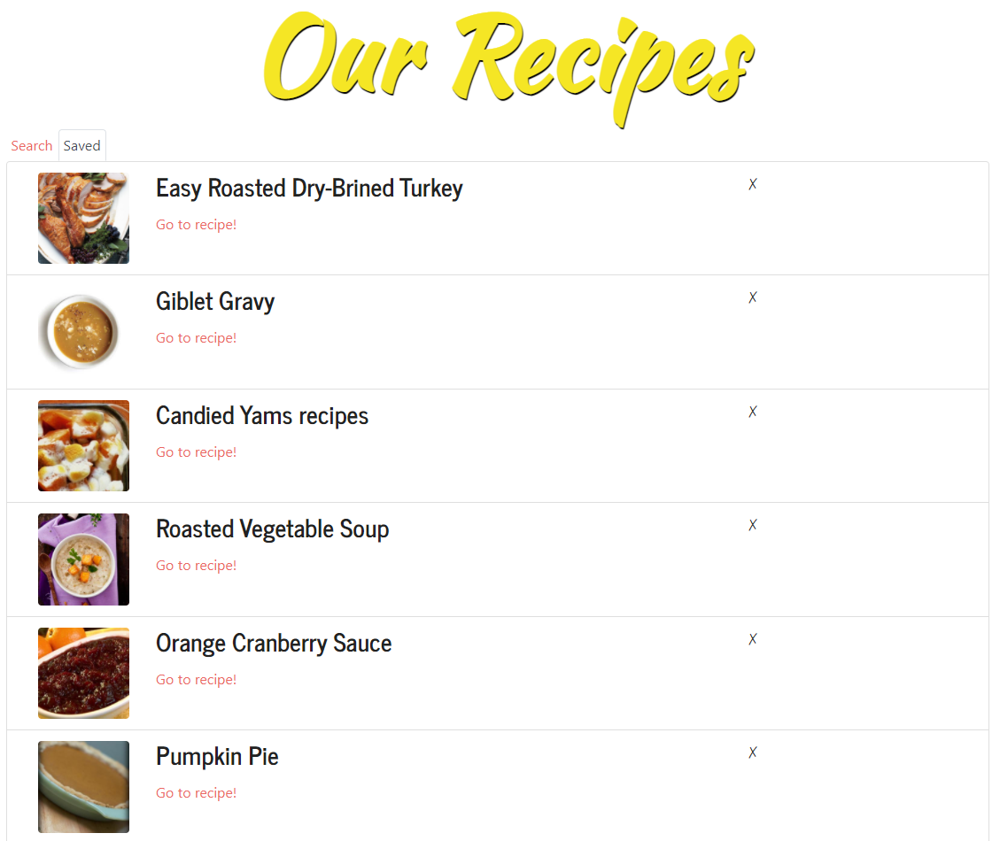

# Thanksgiving Together
  

  ## Description:

There are so many ways in which we've had to adjust our lives in response to the COVID-19 pandemic. One of the major changes for many is that we are missing out on in-person family time that we would otherwise during major holidays. We built this app to solve a need for people who want to celebrate Thanksgiving with family, but who don't want the same videochat experience they've already had too much of from work and school.

Thanksgiving Together allows families to sign up together for a group experience that augments their Zoom call. It includes features like a recipe tracker, games, a "Discussion Topic" button & more.

The app is built on the MERN stack, uses react-bootstrap as a CSS framework, and integrates with the [Zoom SDK](https://marketplace.zoom.us/docs/api-reference/introduction) and the [Edamam API](https://developer.edamam.com/edamam-recipe-api). The Zoom call handling is implemented on a second server ([Link to GitHub Repo](https://github.com/mavn2/zoom_exp)).

This project was initially built in Nov. 2020 over 20 days by 5 people. Our goal is to help families share this holiday *no matter the distance*.

[Link to the Deployed Site](https://thanksgiving-together.herokuapp.com/)     ||    [Link to the GitHub Repo](https://github.com/GAFelton/thanksgiving-together)





  ## Table of Contents

 * [Installation](#Installation)
 * [Usage](#Usage)
 * [License](#License)
 * [Contributing](#Contributing)
 * [Tests](#Tests)
 * [Contributors](#Contributors)
 * [Questions](#Questions)

  

  ## Installation

1. Fork the [repo](https://github.com/GAFelton/thanksgiving-together).

2. Clone the repo to your local machine.

3. On your local repo, run `npm install` for npm packages from both .

4. Create a MongoDB database called `thanksgivingtogetherdb`, and make sure `mongod.exe` is running whenever you want to test the app locally.

5. Create a  file titled `.env` in the root folder. Inside it, you will include your secret key for creating JSON web tokens. For the best security, this should be a randomly generated alphanumeric string of length 64.
   Format for .env file:

   ```
   SECRET={your-secret-here}
   ```

6. Run `npm start` to start your node server, and visit `localhost:3000` to interact with Thanksgiving Together.

  

  ## Usage

Create a user account and a new family or join an existing one. Once you are logged in, the family admin should add Zoom room details via the user settings button and start a Zoom call from the Zoom desktop client (or Zoom's website). The rest of the family can join the call from the Thanksgiving Together app!


  ## License

  [MIT](./LICENSE)

  

  ## Contribution Guidelines

  Reach out if you'd like to collaborate.  Raising an issue, or Pull Requests are welcome!

  

  ## Tests

  Run `npm test` for an ESLint test.

  

## Contributors

| Name                                    |
| --------------------------------------- |
| [Byoung23](https://github.com/Byoung23) |
| [GAFelton](https://github.com/GAFelton) |
| [iveylee](https://github.com/iveylee)   |
| [mavn2](https://github.com/mavn2)       |
| [xelinx](https://github.com/xelinx)     |


  ## Questions

  Please address questions to [GAFelton](https://github.com/GAFelton). ([E-mail](64555318+GAFelton@users.noreply.github.com))

  
